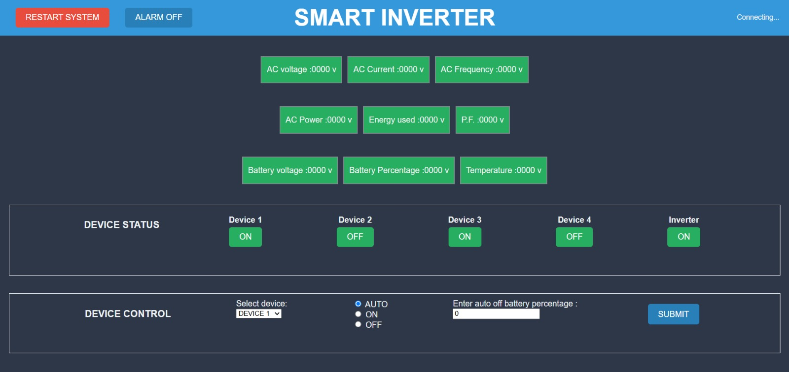

# IoT-Based Smart Inverter System

## Introduction
This project is an IoT-enabled smart inverter system designed to manage energy usage efficiently. It monitors battery levels, prioritizes loads dynamically, integrates renewable energy sources like solar panels, and provides real-time data visualization via a web interface.

## Circuit Design

The circuit design for the IoT-Based Smart Inverter System incorporates several key components to monitor and manage energy usage effectively:

- **Sensors**:
  - **PZEM-0041 (100A)**: Monitors AC voltage, AC current, frequency, and power factor.
  - **12V DC Voltage Sensor**: Measures the DC voltage from the battery.
  - **DHT11**: Monitors temperature and humidity to ensure safe operating conditions.

- **Relay Control**:
  - **5 Relays**: Used for dynamic load management, prioritizing high and low-priority loads based on energy availability.

- **Buzzer**: Provides real-time audio alerts for important system statuses and alerts.

### Circuit Diagram
The complete diagrams and explanations are available in the `circuit-diagrams/` folder.

## App Interface

Below is the user interface of the Smart Inverter App, which allows users to monitor and manage the inverter system through a web interface.

## Features
- **Load Prioritization and Management**: The system uses relays to dynamically manage the loads, ensuring that high-priority devices are powered first based on battery levels and energy availability.
- **Real-Time Monitoring and Data Visualization**: Users can monitor battery levels, load status, temperature, and energy consumption through a real-time web interface.
- **Voice Assistant Alerts**: Optional voice notifications provide real-time system alerts, making the system more user-friendly and accessible.
- **Battery Level Monitoring**: The system provides insights into the level of the connected battery, ensuring users are notified if the battery voltage is too low or if there are any performance issues.

## Circuit Design

## Technologies Used

### Hardware:
- ESP32 microcontroller
- Voltage, current, and temperature sensors
- Solar panels
- Relay modules
- 12V car battery
- DC-to-AC inverter circuit
- Voice module

### Software:
- Embedded C/C++ (ESP32 firmware)
- MQTT for IoT communication
- Web interface (HTML/JavaScript)
- Predictive analytics (optional with Python)
